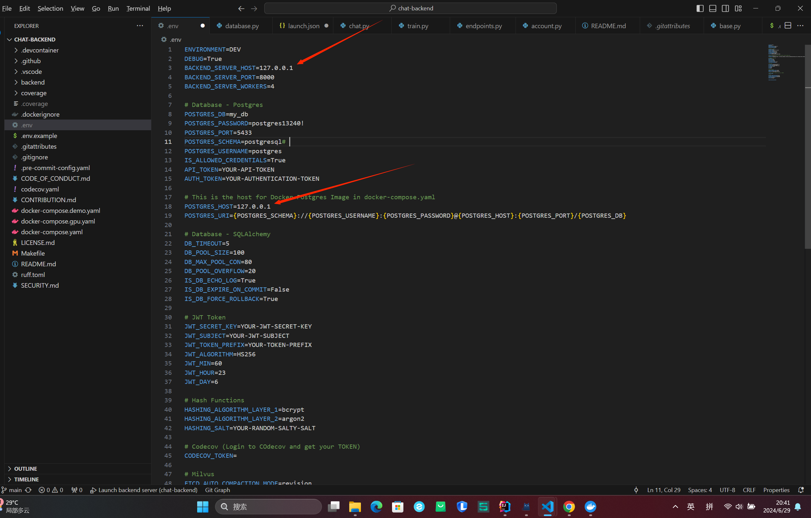
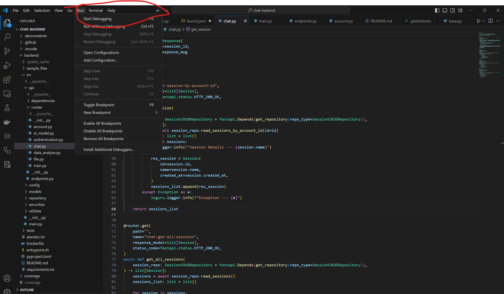

# Windows

## Backend Environment

Before development, please make sure you have installed the Python environment (3.11), as well as Postgre, adminer, milvus, minio, etcd. If not, please refer to the README of the chat-backend repository for installation.

### Install dependencies


```bash
pip3 install -r https://raw.githubusercontent.com/SkywardAI/containers/main/requirements.txt
```

### Configuring Environment Variables

```bash
cp .env.example .env
```

Modify the .env content as follows:
```bash
BACKEND_SERVER_HOST=127.0.0.1
POSTGRES_HOST=127.0.0.1
MILVUS_HOST=127.0.0.1
```



### How to enter debug mode in Windows?
Run => Start Degging



## Front-end environment