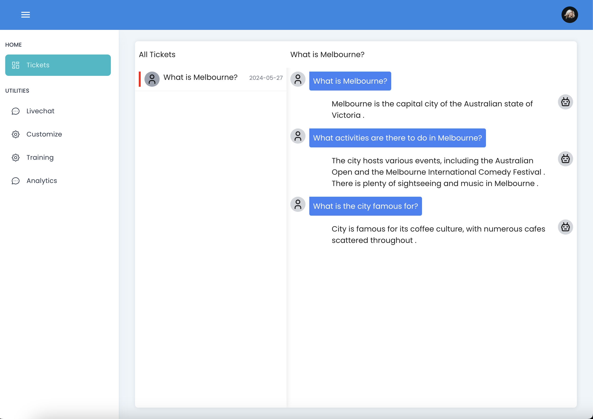
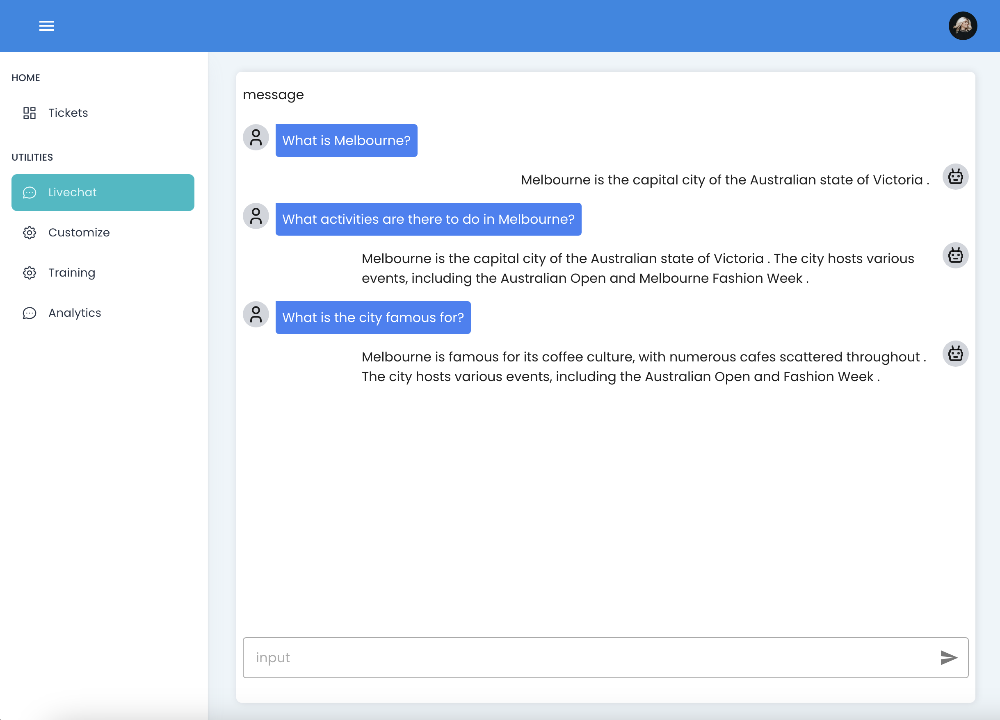

## What is Skyward AI

SkywardAI is an open-source community dedicated to advancing the field of Retrieval-Augmented Generation (RAG) technology. It is created by a group of passionate students from the RMIT University, Melbourne, Australia. Our goal is to provide the free, real open-source RAG framework and data analysis solutions that enable anyone to democratise and run AI on consumer-grade hardware. And also support cloud-native deployment. The community is inspired by an open-source OpenAI alternative API LocalAI.

[Skyward AI Website GitHub](https://github.com/SkywardAI/skywardai.io)

[Skyward AI Frontend GitHub](https://github.com/SkywardAI/chat-frontend) 

[Skyward AI Backend GitHub](https://github.com/SkywardAI/chat-backend) 

## Project Goals
Our vision is to create a thriving community of developers and enthusiasts who are passionate about RAG technology. By fostering collaboration, innovation, and knowledge sharing, we aim to:

#### Drive the adoption of RAG technology
Promote the use of RAG models in a wide range of applications, from customer support to education to entertainment.

#### Empower developers to build cutting-edge RAG solutions
Provide the tools, resources, and support developers need to create powerful and effective RAG models.

#### Foster a culture of openness, inclusivity, and collaboration
Create a welcoming and supportive community where members can learn, grow, and contribute to the advancement of RAG technology.

## RAG (Retrieval-Augmented Generation)

Our open-source framework provides the building blocks you need to develop and implement RAG models for live chat, including modules for data retrieval, knowledge base integration, response generation, and conversation management.

RAG isn't just another AI model; it's Natural language process evolved. Imagine a system that combines the accuracy of information retrieval with the creative spark of language generation. That's the magic of RAG. It can not only find the perfect quote in a vast library, but also weave it into a brilliant new essay. 

Need to answer a complex question? RAG can access the best sources and craft a response that's both informative and insightful. This technology pushes the boundaries of what's possible. It unlocks a new level of accuracy in AI communication.

## Large Language Models (LLM) with RAG

### What is an LLM?

A Large Language Model (LLM) is an artificial intelligence model designed to understand and generate human-like text based on vast amounts of data. These models are trained on diverse datasets containing text from books, websites, articles, and other written material. The primary purpose of LLMs is to predict and generate the next word in a sequence, enabling them to generate coherent and contextually relevant text. Prominent examples of LLMs include OpenAI's GPT-4 and Google's BERT.

### What LLM doesn’t do:

#### Learn
LLMs do not learn from interactions unless they are specifically trained to do so. LLMs can sometimes produce incorrect or misleading information because they rely on the data they were trained on, which might contain inaccuracies or outdated information. They do not have the capability to verify facts against real-time data sources independently.

#### Remember
LLMs do not remember previous prompts in a conversation. Each input is processed independently unless specifically designed with memory mechanisms. This means they cannot access real-time information or retrieve new data beyond what they were trained on. 

#### Reason
LLMs do not reason logically in complex scenarios and do not reliably perform mathematical calculations. They generate responses based on patterns and examples from their training data rather than employing true logical reasoning or problem-solving skills.

#### Search
LLMs do not have the capability to search the internet or make API calls unless integrated with external tools. This means they cannot access real-time information or retrieve new data beyond what they were trained on. Without the ability to dynamically search the web, LLMs may provide outdated or incomplete information. 

### Why we need RAG:

Retrieval-Augmented Generation (RAG) is a technique that combines the strengths of LLMs with information retrieval systems to enhance the accuracy and relevance of generated content. By supplementing LLMs with RAG, we can achieve relevant responses tailored to every product goal. Using our product, Skyward AI, which combines the strengths of LLM and RAG, you can enhance your product's capabilities and meet your specific needs effectively.

#### Improves Accuracy

By integrating real-time information retrieval, RAG helps LLMs access up-to-date and accurate data, reducing the likelihood of generating incorrect information. RAG allows LLMs to pull specific and relevant documents or data points from a vast database, providing better contextual understanding and more precise responses. 

#### Reduces Model Size Requirements:

Instead of embedding vast amounts of knowledge within the model itself, RAG enables smaller models to perform effectively by leveraging external databases, making the system more efficient. Utilising a vector database response is fast and ensures that the most relevant information is quickly accessible.

#### Supports Dynamic Content Generation:

RAG is particularly effective for LLM apps that need to access domain-specific or proprietary data. RAG can dynamically incorporate the latest information, making it particularly useful for applications requiring current data, such as customer support, and personalised recommendations.

Here’s how it does that:

<u>*Insert Your Data:*</u>

RAG allows you to incorporate your own data into the system, ensuring that the LLM has access to the most relevant and specific information needed for your application.

<u>*Fast Vector Database Response:*</u>

RAG uses a vector database to quickly retrieve the most relevant data points, improving response times and accuracy.

<u>*Feeding the Top Search Results to LLM:*</u>

Instead of processing whole documents, RAG feeds the top search results directly to the LLM, making the information retrieval process more efficient and focused

## Technologies Used

### Nuxt

[Nuxt Website](https://nuxt.com/)

Nuxt is a flexible VueJS framework that uses reusable components to dynamically load full-stack web apps.

### GODEL model 

[GODEL GitHub](https://github.com/microsoft/GODEL)

GODEL is a large-scale pre-trained model for goal-directed dialogs. It is trained on at least 551M multi-turn dialogs which makes it more than enough for our current project goals.

### FastAPI and HuggingFace

[Fast API Website](https://fastapi.tiangolo.com/)
[PostgreSQL Website](https://www.postgresql.org/)

We use FastAPI and HuggingFace Python libs to interact with the GODEL seq2seq model (v1.1 base) without GPU acceleration, keeping the model in line with consumer hardware.

### Milvus(vector-db)

[Milvus Vector Database](https://milvus.io/)

We use Milvus to store and retrieve high-dimensional embeddings generated by the GODEL seq2seq model. This handles large-scale vector data efficiently, making it suitable for applications with large data processing needs.

### Docker

[Docker Website](https://www.docker.com/)

We use Docker to containerise our chat bot application, ensuring consistency across different environments, from development to production.

## User Interface

## Testing

### Proposed Testing Workflow - Chatbot

__1. Pre-run unit tests:__
Individual unit tests are carried out on code prior to merging into the production branch.

__2. Launch agent:__
We use docker-compose to spin up an instance of the full-stack web app and load our default GODEL model.

__3. Integration tests:__
This is in development 

__4. User interaction:__
The user engages in menial chat with the chat-bot initially before moving to more complex queries, evaluating key metrics qualitatively.

__5. Observation:__
User feedback is collated and issues are identified for the next development cycle.

### Current Testing Workflow - Codebase

__1. Issue creation:__
A detailed issue report is logged via a GitHub issues and features template

__2. PR requested:__
The code addressing the issue is submitted for reviewing via the core maintainers.

__3. CI/CD:__
Automated testing is then run via GitHub actions to check the code for signing, linting, build and deployment tests.

__4. Pytests:__
PyTest combined with pre-commit runs automated code checks for key functionality as a part of the CI/CD pipeline.

__5. Review & Merge:__
If all tests have passed and the PR has been approved by one or more maintainers, the code is merged into the main branch.
